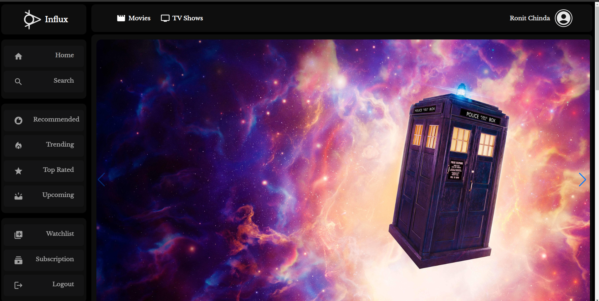
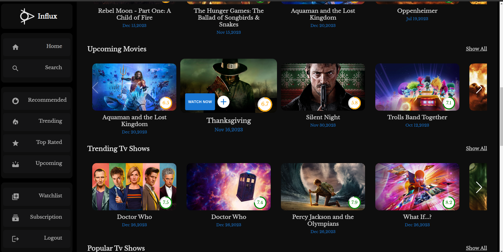
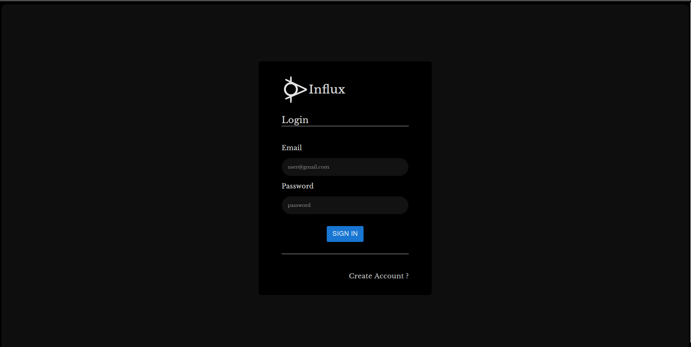
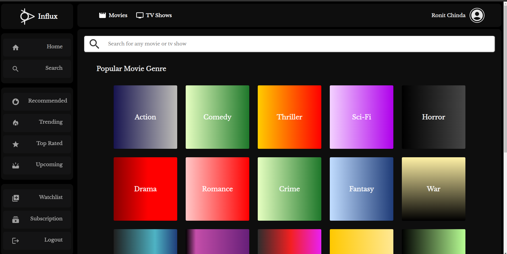
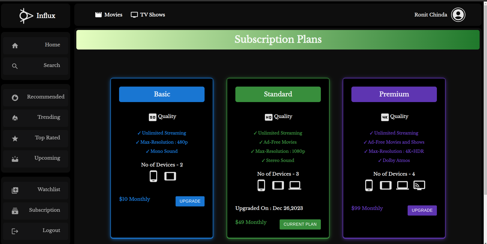
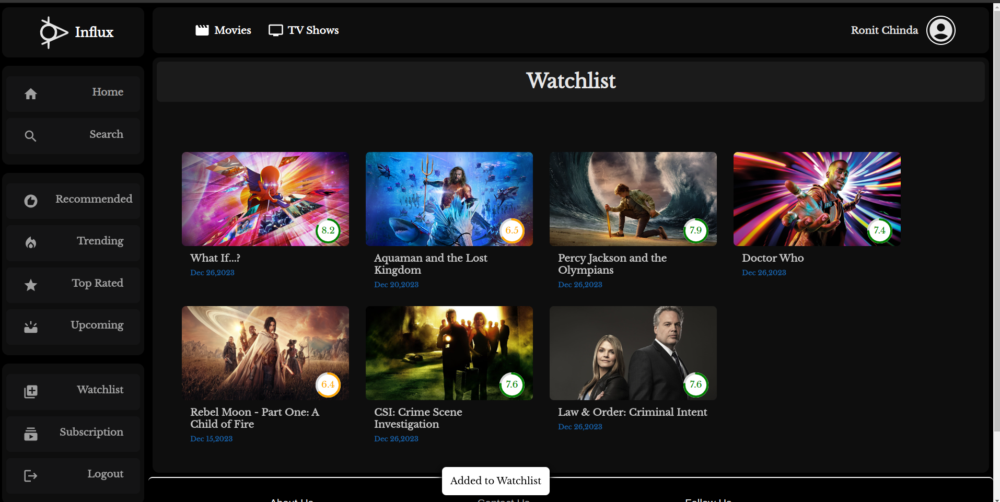
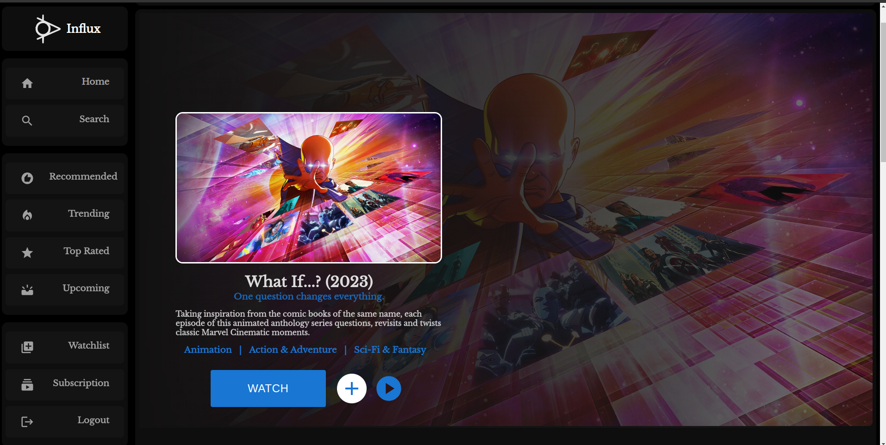
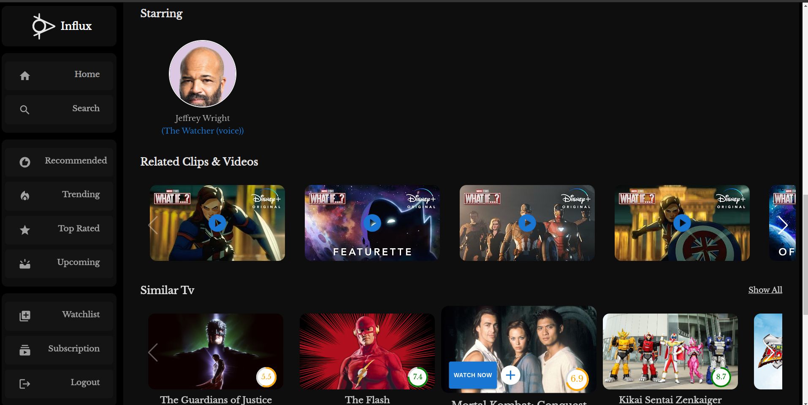
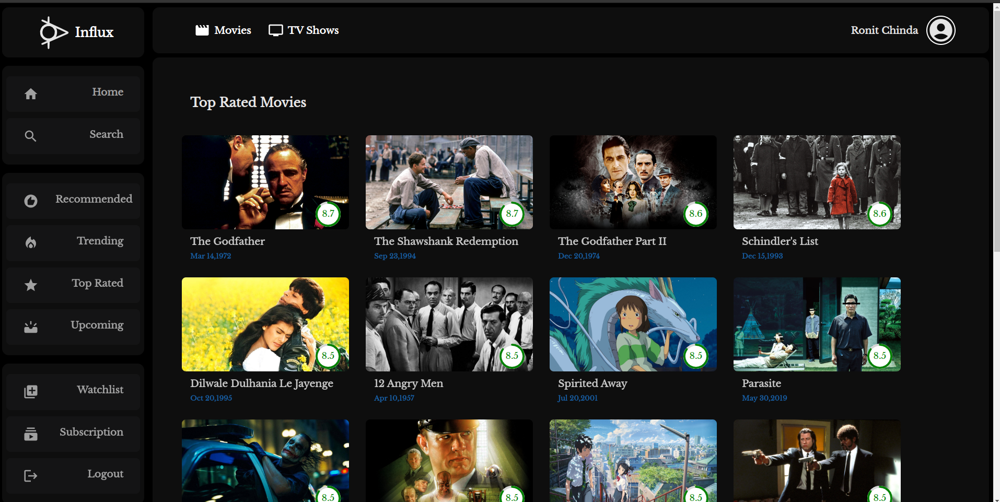

# Influx

## Personal Project

- Influx is an OTT Platform providing a seamless streaming experience with a simple and interactive interface.
- Offers personal recommendations using a Content-Based Recommender System for the content a user is watching.

## Tech Stack

- Node.js
- React.js
- Redux Tookit
- MUI (Material-UI)
- MongoDB Atlas
- Docker (Microservices)
- AWS ec2
- Aws Cloudfront
- Aws Api Gateway

## Preview

### Main 

### HomePage 

### Signin 

### Search

### Subscription

### Watchlist

### Watch Movie

### Related Movie Content

### Any Genre

